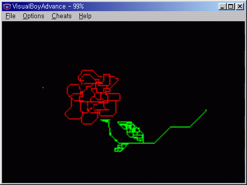
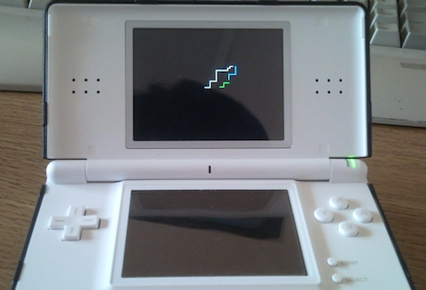

# GBAPainter
Painter application for Gameboy Advance.

## Usage
- Arrow Key : Move cursor
- A : draw a pixel with color
- L/R : Change color

## Screenshot
- running in a GBA emulator (VirtualBoyAdvance)

- running in a real platform (Nintendo DS Slot 2)

